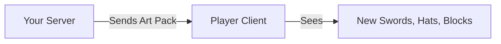

# Art Packs

**Art Packs** are how you add custom visuals to Hytale. Unlike resource packs in Minecraft which replace existing textures, Art Packs allow you to add **new** content alongside the old.

## How It Works

When a player joins your server, they automatically download your Art Pack.

## What Can You Add?

| Feature | Description |
|---------|-------------|
| **[Textures](./textures)** | Images for blocks, items, and UI. |
| **[Models](./models)** | 3D shapes for entities and custom items. |
| **[Animations](./animations)** | Movement for your models. |
| **Sounds** | (Covered in [Resource Packs](../resource-packs/sounds)) |

---

## The Workflow

1. **Create** your assets (draw textures, make models).
2. **Package** them into a zip file (or folder).
3. **Configure** Hytale to load them.

## Next Steps

Start by drawing some textures:

→ **Next: [Creating Textures](./textures)**
