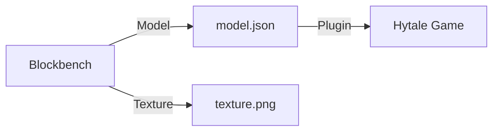

# Custom Models

New textures are cool, but new shapes are better. Custom models allow you to create completely new creatures, weapons, and furniture.

## How it Works

We use **Blockbench**, a free program to model 3D assets.



---

## 1. The Tool: Blockbench

Download [Blockbench](https://www.blockbench.net/). It's the industry standard for Minecraft-style modeling.

### Creating a Model

1. Open Blockbench.
2. Select **"Generic Model"** (or Hytale specific if available).
3. Use cubes to build your shape.
4. Paint your texture directly on the model.

---

## 2. Exporting

When you are done, you need two files:

1. **The Model Geometry:** The shape (vertices, cubes).
2. **The Texture:** The colors (png).

Save your model file into your project assets folder, usually under `assets/models/`.

```
assets
├── models
│   └── custom_sword.json
└── textures
    └── custom_sword.png
```

---

## 3. Using it in Code

Register the model in your plugin so Hytale knows about it.

```java
// Example pseudo-code for registering a model
ModelManager.register("my_sword", new Model("assets/models/custom_sword.json"));
```

(Note: Exact API calls may vary depending on the Hytale version/modding API state).

---

## Tips for Good Models

- **Keep it Simple:** Too many cubes can lag the server.
- **Consistent Style:** Try to match Hytale's pixel density.
- **Pivot Points:** Ensure your pivot points are correct so limbs rotate naturally.

---

## Troubleshooting

| Problem | Solution |
|---------|----------|
| **Invisible Model** | Check if the texture is linked correctly in the JSON file. |
| **Backward Face** | Some faces might be inverted. Check "Backface Culling" in Blockbench. |
| **Wrong Size** | Check your export scale. Hytale might expect different units. |

---

## Next Steps

A static model is like a statue. Let's make it move!

→ **Next: [Animations](./animations)**
