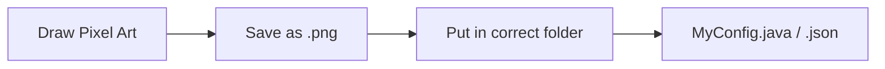

# Creating Textures

Textures are the skin of your game. Every block, item, and entity needs a texture.

## How it Works

Hytale uses standard `.png` images. You can use any image editor like Photoshop, Aseprite, or Blockbench.



---

## 1. File Formats & Rules

- **Format:** `.png` (always!)
- **Size:** Powers of 2 (16x16, 32x32, 64x64)
- **Transparency:** Supported (use it for glass, leaves, etc.)

::: tip Naming Convention
Use `snake_case` for filenames. No spaces or capitals! 
- [GOOD] `my_sword.png`
- [BAD] `My Sword.png`
:::

---

## 2. Where to Put Them

Your textures go inside your project's resource folder.

```
src
└── main
    └── resources
        └── assets
            └── textures
                ├── items
                │   └── my_custom_sword.png
                ├── blocks
                │   └── my_custom_block.png
                ├── entities
                │   └── my_custom_zombie.png
                └── ui
                    └── my_menu_bg.png
```

---

## 3. Registering Textures

Just having the file isn't enough. You usually need to tell Hytale about it in a JSON file or your Plugin code.

### Example: Custom Item Model

If you have `my_sword.png`, you reference it in your item definition:

```json
{
  "name": "my_sword",
  "texture": "assets/textures/items/my_custom_sword.png"
}
```

---

## Tools We Recommend

| Tool | Purpose | License | Cost | Download | Source |
|------|---------|---------|------|----------|--------|
| **Blockbench** | 3D Models & Texturing | <Badge type="tip" text="Open Source (GPL)" /> | Free | [Website](https://www.blockbench.net) | [GitHub](https://github.com/JannisX11/blockbench) |
| **Aseprite** | Pixel Art (Best choice) | <Badge type="warning" text="Source Available" /> | Paid | [Website](https://www.aseprite.org) | [GitHub](https://github.com/aseprite/aseprite) |
| **GIMP** | General Image Editing | <Badge type="tip" text="Open Source (GPL)" /> | Free | [Website](https://www.gimp.org) | [GitLab](https://gitlab.gnome.org/GNOME/gimp) |
| **Paint.NET** | Simple Image Editing | <Badge text="Closed Source" /> | Free | [Website](https://www.getpaint.net) | - |

::: tip Why Blockbench?
Blockbench is the industry standard for Hytale modeling. It is fully **Open Source** (GPL) and allows you to paint textures directly onto your 3D models!
:::

---

## Troubleshooting

| Problem | Cause | Solution |
|---------|-------|----------|
| **Purple/Black Checkerboard** | Texture missing | Check if filename matches *exactly* (case-sensitive!) |
| **Blurry Texture** | Wrong import settings | Make sure to set scaling to "Nearest Neighbor" |
| **White Background** | No transparency | Erase the background in your image editor |

---

## Next Steps

Now that you have textures, let's put them on a 3D object:

→ **Next: [Custom Models](./models)**
