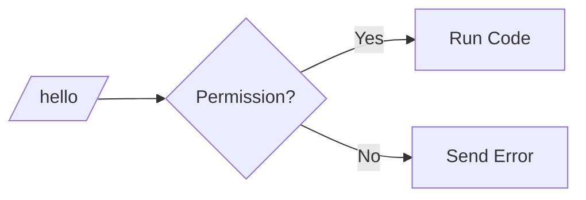

# Commands

Commands allow players to interact with your plugin using chat. This guide covers creating, registering, and handling commands.

## Basic Command

### Creating a Command Class

```java
public class HelloCommand implements Command {
    
    @Override
    public String getName() {
        return "hello";
    }
    
    @Override
    public String getDescription() {
        return "Says hello to the player";
    }
    
    @Override
    public void execute(CommandContext context) {
        Player player = context.getPlayer();
        player.sendMessage("Hello, " + player.getName() + "!");
    }
}
```java
public class HelloCommand implements Command {
    // ...
}
```

### The Command Lifecycle



### Registering Commands

Register commands in your plugin's `onEnable()`:

```java
@Override
public void onEnable(PluginContext context) {
    context.getCommandManager().register(new HelloCommand());
    context.getCommandManager().register(new TeleportCommand());
}
```

## Command Arguments

Access command arguments from the context:

```java
public class GiveCommand implements Command {
    
    @Override
    public String getName() {
        return "give";
    }
    
    @Override
    public void execute(CommandContext context) {
        String[] args = context.getArgs();
        
        if (args.length < 2) {
            context.getPlayer().sendMessage("Usage: /give <player> <item>");
            return;
        }
        
        String targetName = args[0];
        String itemName = args[1];
        int amount = args.length > 2 ? Integer.parseInt(args[2]) : 1;
        
        // Give item logic here
        context.getPlayer().sendMessage("Gave " + amount + " " + itemName + " to " + targetName);
    }
}
```

## Command with Subcommands

Create commands with multiple subcommands:

```java
public class WarpCommand implements Command {
    private final Map<String, Location> warps = new HashMap<>();
    
    @Override
    public String getName() {
        return "warp";
    }
    
    @Override
    public void execute(CommandContext context) {
        String[] args = context.getArgs();
        Player player = context.getPlayer();
        
        if (args.length == 0) {
            showHelp(player);
            return;
        }
        
        String subcommand = args[0].toLowerCase();
        
        switch (subcommand) {
            case "set":
                handleSet(player, args);
                break;
            case "delete":
                handleDelete(player, args);
                break;
            case "list":
                handleList(player);
                break;
            default:
                handleTeleport(player, subcommand);
                break;
        }
    }
    
    private void handleSet(Player player, String[] args) {
        if (args.length < 2) {
            player.sendMessage("Usage: /warp set <name>");
            return;
        }
        String name = args[1];
        warps.put(name, player.getLocation());
        player.sendMessage("Warp '" + name + "' created!");
    }
    
    private void handleDelete(Player player, String[] args) {
        if (args.length < 2) {
            player.sendMessage("Usage: /warp delete <name>");
            return;
        }
        String name = args[1];
        if (warps.remove(name) != null) {
            player.sendMessage("Warp '" + name + "' deleted!");
        } else {
            player.sendMessage("Warp not found!");
        }
    }
    
    private void handleList(Player player) {
        if (warps.isEmpty()) {
            player.sendMessage("No warps set.");
            return;
        }
        player.sendMessage("Warps: " + String.join(", ", warps.keySet()));
    }
    
    private void handleTeleport(Player player, String warpName) {
        Location location = warps.get(warpName);
        if (location != null) {
            player.teleport(location);
            player.sendMessage("Teleported to " + warpName);
        } else {
            player.sendMessage("Warp not found!");
        }
    }
}
```

## Permissions

Check permissions before executing:

```java
@Override
public void execute(CommandContext context) {
    Player player = context.getPlayer();
    
    if (!player.hasPermission("myplugin.admin")) {
        player.sendMessage("You don't have permission to use this command!");
        return;
    }
    
    // Admin-only code here
}
```

Define required permissions in the command:

```java
@Override
public String getPermission() {
    return "myplugin.hello";
}
```

## Tab Completion

Provide suggestions for tab completion:

```java
@Override
public List<String> tabComplete(CommandContext context) {
    String[] args = context.getArgs();
    
    if (args.length == 1) {
        // First argument: suggest subcommands
        return Arrays.asList("set", "delete", "list");
    }
    
    if (args.length == 2 && args[0].equals("delete")) {
        // Second argument for delete: suggest warp names
        return new ArrayList<>(warps.keySet());
    }
    
    return Collections.emptyList();
}
```

## Command Aliases

Register multiple names for the same command:

```java
@Override
public String[] getAliases() {
    return new String[] { "hi", "greet" };
}
```

Now `/hello`, `/hi`, and `/greet` all work.

## Console Commands

Handle commands from console (non-player):

```java
@Override
public void execute(CommandContext context) {
    if (!context.isPlayer()) {
        // Executed from console
        context.sendMessage("Running from console");
        handleConsoleExecution(context);
        return;
    }
    
    // Player execution
    Player player = context.getPlayer();
    handlePlayerExecution(player, context);
}
```

## Error Handling

Always validate input and handle errors:

```java
@Override
public void execute(CommandContext context) {
    String[] args = context.getArgs();
    Player player = context.getPlayer();
    
    // Check argument count
    if (args.length < 1) {
        player.sendMessage("Usage: /settime <day|night|noon|midnight>");
        return;
    }
    
    // Validate argument
    String time = args[0].toLowerCase();
    if (!isValidTime(time)) {
        player.sendMessage("Invalid time! Use: day, night, noon, or midnight");
        return;
    }
    
    try {
        setWorldTime(time);
        player.sendMessage("Time set to " + time);
    } catch (Exception e) {
        player.sendMessage("Failed to set time!");
        context.getLogger().error("Error setting time", e);
    }
}
```

## Cooldowns

Prevent command spam:

```java
public class CooldownCommand implements Command {
    private final Map<UUID, Long> cooldowns = new HashMap<>();
    private static final long COOLDOWN_MS = 5000; // 5 seconds
    
    @Override
    public void execute(CommandContext context) {
        Player player = context.getPlayer();
        UUID uuid = player.getUUID();
        
        long now = System.currentTimeMillis();
        Long lastUse = cooldowns.get(uuid);
        
        if (lastUse != null && (now - lastUse) < COOLDOWN_MS) {
            long remaining = (COOLDOWN_MS - (now - lastUse)) / 1000;
            player.sendMessage("Please wait " + remaining + " seconds!");
            return;
        }
        
        // Execute command
        cooldowns.put(uuid, now);
        doCommand(player);
    }
}
```

## Example: Complete Spawn Command

A full-featured spawn command with teleport delay and movement cancellation:

```java
public class SpawnCommand implements Command {
    private final PluginContext context;
    private final Map<UUID, Location> pendingTeleports = new HashMap<>();
    
    public SpawnCommand(PluginContext context) {
        this.context = context;
    }
    
    @Override
    public String getName() {
        return "spawn";
    }
    
    @Override
    public String getDescription() {
        return "Teleport to spawn";
    }
    
    @Override
    public String getPermission() {
        return "essentials.spawn";
    }
    
    @Override
    public void execute(CommandContext ctx) {
        Player player = ctx.getPlayer();
        Location spawn = getSpawnLocation();
        
        if (player.hasPermission("essentials.spawn.instant")) {
            player.teleport(spawn);
            player.sendMessage("Teleported to spawn!");
            return;
        }
        
        // Start countdown
        player.sendMessage("Teleporting in 3 seconds... Don't move!");
        Location startPos = player.getLocation();
        pendingTeleports.put(player.getUUID(), startPos);
        
        // Schedule teleport
        context.getScheduler().runLater(() -> {
            if (!pendingTeleports.containsKey(player.getUUID())) {
                return; // Cancelled
            }
            
            pendingTeleports.remove(player.getUUID());
            player.teleport(spawn);
            player.sendMessage("Teleported to spawn!");
        }, 60); // 60 ticks = 3 seconds
    }
    
    @EventHandler
    public void onMove(PlayerMoveEvent event) {
        UUID uuid = event.getPlayer().getUUID();
        Location startPos = pendingTeleports.get(uuid);
        
        if (startPos != null && hasMoved(startPos, event.getTo())) {
            pendingTeleports.remove(uuid);
            event.getPlayer().sendMessage("Teleport cancelled - you moved!");
        }
    }
    
    private boolean hasMoved(Location from, Location to) {
        return from.getX() != to.getX() || 
               from.getY() != to.getY() || 
               from.getZ() != to.getZ();
    }
}
```
