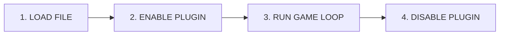

# Plugin Development Guide

Welcome to the Plugin Development Guide! If you've completed the [Getting Started](/getting-started/) tutorial and built your first Hello World plugin, you're ready to dive deeper.

This guide will teach you everything you need to create fully-featured Hytale plugins.

## What You'll Learn

By the end of this guide, you'll understand:

| Chapter | What You'll Build |
|---------|-------------------|
| **1. Plugin Basics** | Proper plugin structure, manifest files, and how plugins work |
| **2. Player & World** | Permissions, configuration files, and scheduled tasks |
| **3. Advanced Features** | Custom UIs and prefabs for immersive experiences |

## Prerequisites

Before starting this guide, make sure you have:

- [x] **Completed** the [Hello World tutorial](/getting-started/hello-world)
- [x] **A running server** with your test plugin installed
- [x] **Your IDE** set up and ready to code

::: tip First Time Here?
If you haven't built a plugin yet, start with the [Getting Started](/getting-started/) section first. It walks you through everything step by step.
:::

---

## How Plugins Work

Before we dive into code, let's understand what happens when your plugin runs.

### The Plugin Lifecycle

Every plugin goes through these stages:



### What Goes Where?

Here's what you should do in each lifecycle method:

**In `onEnable()` - Setup:**
- Register your event listeners
- Register your commands  
- Load configuration files
- Connect to databases (if needed)
- Log a startup message

**In `onDisable()` - Cleanup:**
- Save any unsaved data
- Cancel running tasks
- Close database connections
- Log a shutdown message

### Example Plugin Structure

Here's what a well-organized plugin looks like:

```java
public class MyPlugin implements Plugin {
    private PluginContext context;
    
    @Override
    public void onEnable(PluginContext context) {
        this.context = context;
        
        // Step 1: Register event listeners
        context.getEventManager().register(new PlayerListener(context));
        context.getEventManager().register(new WorldListener(context));
        
        // Step 2: Register commands
        context.getCommandManager().register(new SpawnCommand(context));
        context.getCommandManager().register(new HomeCommand(context));
        
        // Step 3: Let everyone know we're ready
        context.getLogger().info("MyPlugin enabled successfully!");
    }
    
    @Override
    public void onDisable() {
        context.getLogger().info("MyPlugin disabled. Goodbye!");
    }
}
```

---

## The PluginContext

The `PluginContext` is your plugin's gateway to the server. Think of it as your toolbox - it provides access to everything you need.

### What's in the Toolbox?

```java
// LOGGING - Print messages to the console
context.getLogger().info("This is an info message");
context.getLogger().warn("This is a warning");
context.getLogger().error("Something went wrong!", exception);

// EVENTS - React to things happening in the game
context.getEventManager().register(myListener);

// COMMANDS - Let players run commands
context.getCommandManager().register(myCommand);

// OTHER PLUGINS - Check if other plugins are installed
if (context.getPluginManager().isPluginLoaded("other-plugin")) {
    // Do something special
}

// DATA STORAGE - Get your plugin's folder for saving files
Path myFolder = context.getDataFolder();
// Result: mods/my-plugin/
```

::: info Keep It Safe
Always store your `context` in a field so you can use it later in your event handlers and commands.
:::

---

## Project Organization

As your plugin grows, organization becomes important. Here's the recommended structure:

```
my-plugin/
├── build.gradle.kts          # Build configuration
├── settings.gradle.kts       # Project name
└── src/main/
    ├── java/com/example/myplugin/
    │   ├── MyPlugin.java           # Main class (keep it small!)
    │   ├── commands/               # All command classes
    │   │   ├── SpawnCommand.java
    │   │   └── HomeCommand.java
    │   ├── listeners/              # All event listeners
    │   │   ├── PlayerListener.java
    │   │   └── WorldListener.java
    │   ├── config/                 # Configuration handling
    │   │   └── PluginConfig.java
    │   └── util/                   # Helper classes
    │       └── MessageUtil.java
    └── resources/
        └── manifest.json           # Plugin metadata
```

### Why This Structure?

- **Easy to find things** - Commands are in `commands/`, listeners in `listeners/`
- **Clean main class** - Your `MyPlugin.java` only handles setup
- **Reusable code** - Utility classes can be shared across features
- **Team-friendly** - Multiple people can work without conflicts

---

## Next Steps

Ready to start building? Here's the path:

### Chapter 1: Plugin Basics

1. **[Manifest File](./manifest)** - Configure your plugin's identity and dependencies
2. **[Events & Listeners](./events)** - React to player actions and world changes
3. **[Commands](./commands)** - Create commands players can run

### Chapter 2: Player & World

4. **[Permissions](./permissions)** - Control who can do what
5. **[Configuration](./configuration)** - Let server admins customize your plugin
6. **[Scheduling Tasks](./scheduling)** - Run code on a timer or with delays

### Chapter 3: Advanced Features

7. **[Custom UIs](./custom-ui)** - Create beautiful interactive menus
8. **[Prefabs](./prefabs)** - Spawn and manage structures

---

::: tip Bookmark This Page
This guide is your reference. Come back here whenever you need a refresher on plugin structure or lifecycle.
:::
