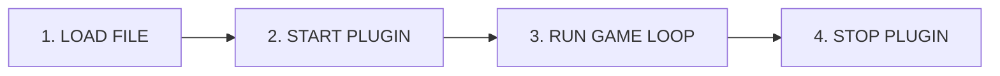

# Plugin Development Guide

Welcome to the Plugin Development Guide!

## How Plugins Work

Before we dive into code, let's understand what happens when your plugin runs.

### The Plugin Lifecycle

Every plugin goes through these stages:



### What Goes Where?

Here's what you should do in each lifecycle method:

**In `start()` - Setup:**
- Register your event listeners
- Register your commands  
- Load configuration files
- Log a startup message

**In `stop()` - Cleanup:**
- Save any unsaved data
- Cancel running tasks
- Log a shutdown message

### Example Plugin Structure

```java
import com.hypixel.hytale.server.core.plugin.JavaPlugin;
import com.hypixel.hytale.server.core.plugin.JavaPluginInit;

public class MyPlugin extends JavaPlugin {
    
    public MyPlugin(JavaPluginInit init) {
        super(init);
    }
    
    @Override
    public void start() {
        // Step 1: Register event listeners
        // ...
        
        // Step 2: Register commands
        // ...
        
        // Step 3: Let everyone know we're ready
        System.out.println("MyPlugin enabled successfully!");
    }
    
    @Override
    public void stop() {
        System.out.println("MyPlugin disabled. Goodbye!");
    }
}
```

---

## Project Organization

Recommended structure:

```
my-plugin/
├── build.gradle.kts
├── settings.gradle.kts
└── src/main/
    ├── java/com/example/myplugin/
    │   ├── MyPlugin.java
    │   ├── commands/
    │   ├── listeners/
    │   └── config/
    └── resources/
        └── manifest.json
```