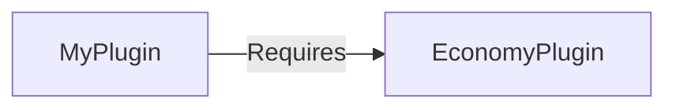

# Manifest File

Every plugin needs a `manifest.json` file. This tells the server who you are, what your plugin is called, and where to find your code.

Think of it as your plugin's ID card.

## Where Does It Go?

The manifest file must be in your JAR's root. When using Gradle, put it here:

```
src/main/resources/manifest.json
```

Gradle automatically includes everything in `resources/` in your JAR.

---

## Your First Manifest

Let's create a manifest step by step. Start with the bare minimum:

```json
{
  "Group": "com.yourname",
  "Name": "my-plugin",
  "Version": "1.0.0",
  "Main": "com.yourname.myplugin.MyPlugin"
}
```

That's it! Just 4 fields and your plugin is valid.

### What Each Field Means

| Field | What It Does | Example |
|-------|--------------|---------|
| `Group` | Your organization or username (reverse domain) | `"com.yourname"` |
| `Name` | The name of your plugin (ID) | `"my-plugin"` |
| `Version` | Your plugin's version number | `"1.0.0"` |
| `Main` | The full path to your main class | `"com.yourname.myplugin.MyPlugin"` |

::: tip About the Main Class
The `Main` field is the **fully qualified class name** of your main plugin class. This is the class that implements `Plugin` and has `onEnable()`.

It must match exactly - including capitalization!
:::

---

## Step by Step: Creating Your ID

The combination of `Group` and `Name` creates your unique ID.

### Use Reverse Domain Notation for Group

Just like Java packages, use your domain name backwards:

```
Your domain: yourname.com
Your Group:  com.yourname
```

### Examples

| Who You Are | Group | Name | Resulting ID |
|-------------|-------|------|--------------|
| Personal project | `com.myname` | `my-plugin` | `com.myname.my-plugin` |
| Organization | `org.myorg` | `cool-plugin` | `org.myorg.cool-plugin` |
| GitHub username | `io.github.myname` | `plugin` | `io.github.myname.plugin` |

---

## Adding More Information

You can add optional fields to describe your plugin better:

```json
{
  "Group": "com.yourname",
  "Name": "my-plugin",
  "Version": "1.0.0",
  "Main": "com.yourname.myplugin.MyPlugin",
  "Description": "Adds cool features to your server",
  "Authors": ["YourName", "ContributorName"]
}
```

### Optional Fields

| Field | Type | Description |
|-------|------|-------------|
| `Description` | string | Brief description of what your plugin does |
| `Authors` | string[] | List of people who made the plugin |
| `Dependencies` | object[] | Other plugins yours requires |
| `SoftDependencies` | string[] | Optional plugins yours can use |
| `IncludesAssetPack` | boolean | Set to `true` if your plugin has a `assets` folder |

---

## Dependencies: Requiring Other Plugins

Sometimes your plugin needs another plugin to work. For example, maybe you're building on top of an economy plugin.

### Hard Dependencies

If your plugin **cannot work** without another plugin:

```json
{
  "Group": "com.yourname",
  "Name": "shops",
  "Version": "1.0.0",
  "Main": "com.yourname.shops.ShopsPlugin",
  "Dependencies": [
    {
      "Name": "economy",
      "Group": "com.example",
      "Version": ">=1.0.0"
    }
  ]
}
```

**What happens:**
- If present → economy loads first, then your plugin



### Version Specifiers

| Specifier | Meaning |
|-----------|---------|
| `"1.0.0"` | Exactly version 1.0.0 |
| `">=1.0.0"` | Version 1.0.0 or higher |
| `">1.0.0"` | Higher than 1.0.0 |
| `"<2.0.0"` | Lower than 2.0.0 |
| `"*"` | Any version |

::: tip Common Pattern
Use `>=X.Y.Z` to require "at least" a specific version. This allows updates to work.
:::

---

## Soft Dependencies: Optional Integrations

Sometimes you want to **optionally** integrate with another plugin. If it's there, use it. If not, continue without it.

```json
{
  "Group": "com.yourname",
  "Name": "my-plugin",
  "Version": "1.0.0",
  "Main": "com.yourname.myplugin.MyPlugin",
  "SoftDependencies": ["com.example.optional-plugin"]
}
```

**What happens:**
- Server checks if `com.example.optional-plugin` is installed
- If present → it loads first, then your plugin
- If missing → your plugin loads anyway

### Using Soft Dependencies in Code

Check at runtime if the optional plugin is available:

```java
@Override
public void onEnable(PluginContext context) {
    // Check if optional plugin is installed
    if (context.getPluginManager().isPluginLoaded("com.example.optional-plugin")) {
        context.getLogger().info("Found optional-plugin! Enabling extra features.");
        setupOptionalIntegration();
    } else {
        context.getLogger().info("optional-plugin not found. Using basic mode.");
    }
}
```

---

## Version Numbers: Semantic Versioning

It's important to version your plugin correctly so others know what to expect.

### The Format: MAJOR.MINOR.PATCH

```
1.0.0
│ │ │
│ │ └── PATCH: Bug fixes only
│ └──── MINOR: New features (backwards compatible)
└────── MAJOR: Breaking changes
```

### When to Bump Each Number

| Change Type | Version Change | Example |
|-------------|----------------|---------|
| Fixed a bug | 1.0.0 → 1.0.1 | Fixed crash on join |
| Added a feature (no breaking changes) | 1.0.1 → 1.1.0 | Added /home command |
| Removed/changed something that breaks old behavior | 1.1.0 → 2.0.0 | Changed config format |

---

## Complete Example

Here's a full manifest with all common fields:

```json
{
  "Group": "com.example",
  "Name": "essentials-lite",
  "Version": "1.2.0",
  "Description": "Essential commands for your Hytale server",
  "Authors": ["EuropeanPepe"],
  "Main": "com.example.essentialslite.EssentialsLite",
  "IncludesAssetPack": true,
  "Dependencies": [
    {
      "Name": "permissions-api",
      "Group": "com.example",
      "Version": ">=1.0.0"
    }
  ],
  "SoftDependencies": ["com.example.economy"]
}
```

---

## Troubleshooting

### Common Errors

| Error Message | What It Means | How to Fix |
|---------------|---------------|------------|
| `Missing required field: Name` | Your manifest doesn't have a `Name` | Add the `Name` field |
| `Invalid Main` | Can't find your main class | Check the class path and spelling |
| `Dependency not found` | A required plugin isn't installed | Install the dependency or remove it from manifest |
| `Could not parse manifest.json` | JSON syntax error | Check for missing commas or quotes |

### JSON Tips

JSON is strict about syntax. Common mistakes:

```json
// [BAD] Wrong: trailing comma
{
  "Name": "my-plugin",
  "Version": "1.0.0",  // ← This comma is wrong because it's the last item
}

// [GOOD] Correct: no trailing comma
{
  "Name": "my-plugin",
  "Version": "1.0.0"
}
```

```json
// [BAD] Wrong: single quotes
{
  'Name': 'my-plugin'
}

// [GOOD] Correct: double quotes only
{
  "Name": "my-plugin"
}
```

---

## Next Steps

Now that your manifest is set up, let's learn how to react to things happening in the game:

→ **Next: [Events & Listeners](./events)**