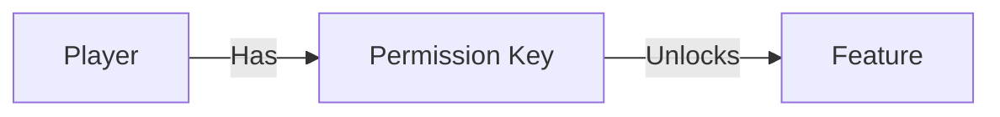

# Permissions

Permissions are the keys to your plugin's features. They let you control who can do what - like letting admins ban players but stopping regular players from using God mode.

## How Permissions Work

It's a simple lock-and-key system:

1. **The Lock:** Your code checks for a permission string (e.g., `myplugin.admin`)
2. **The Key:** The server gives that permission to specific players or groups
3. **The Result:** If they have the key, the door opens (code executes)



---

## Checking Permissions

### The Basics

Checking a permission is just one line of code:

```java
if (player.hasPermission("myplugin.coolfeature")) {
    player.sendMessage("You have access!");
} else {
    player.sendMessage("Access denied.");
}
```

### In Commands

This is where you'll use permissions most often. You don't want everyone using `/ban`!

```java
@Override
public void execute(CommandContext context) {
    Player player = context.getPlayer();
    
    // 1. Check for the key
    if (!player.hasPermission("myplugin.admin.ban")) {
        player.sendMessage("You don't have permission to use this!");
        return; // Stop right here!
    }
    
    // 2. Do the admin stuff
    handleBan(player);
}
```

### Auto-Checking Commands

You can also tell Hytale to check for you automatically:

```java
public class BanCommand implements Command {
    // ... name, description ...

    @Override
    public String getPermission() {
        return "myplugin.admin.ban";
    }
    
    @Override
    public void execute(CommandContext context) {
        // This only runs if they have permission!
        handleBan(context.getPlayer());
    }
}
```

---

## Naming Your Permissions

Permissions are just strings, but you should follow a pattern to keep them organized.

### The Dot Pattern

Use dots to create categories:

`pluginName.category.action`

| Permission | What it allows |
|------------|----------------|
| `essentials.spawn` | Using /spawn |
| `essentials.warp.use` | Using warps |
| `essentials.warp.create` | Creating new warps |
| `essentials.warp.delete` | Deleting warps |
| `essentials.admin` | All admin features |

::: tip Best Practice
Always start with your **plugin ID** or name. This prevents conflicts with other plugins!
:::

---

## Giving Permissions to Players

As a plugin developer, you **check** for permissions. The server admin **gives** them.

Admins configure this in the server's `permissions.json` file:

```json
{
  "groups": {
    "default": {
      "permissions": [
        "essentials.spawn",
        "essentials.warp.use"
      ]
    },
    "admin": {
      "permissions": [
        "*"  // Grants everything!
      ]
    }
  }
}
```

### Wildcards

The `*` is a wildcard. It matches anything.

- `*` = All permissions
- `essentials.*` = All permissions starting with "essentials."
- `essentials.warp.*` = All warp permissions (create, delete, use)

---

## Advanced Usage

### Feature Toggling

You can use permissions to enable special features for VIPs:

```java
@EventHandler
public void onJoin(PlayerJoinEvent event) {
    Player player = event.getPlayer();
    
    // VIPs get a special welcome
    if (player.hasPermission("myplugin.vip.welcome")) {
        FireworkUtil.launchFirework(player.getLocation());
        broadcast("Welcome VIP " + player.getName() + "!");
    }
    
    // Admins get notified of reports
    if (player.hasPermission("myplugin.admin.alerts")) {
        player.sendMessage("There are 3 unresolved reports.");
    }
}
```

### Negating Permissions

Sometimes you want to give a group everything *except* one thing. You can check for negative permissions by looking for standard ones, but admins can configure them with a `-` prefix.

If an admin gives `-essentials.spawn`, then `hasPermission("essentials.spawn")` returns `false`, even if they have `essentials.*`.

---

## Common Patterns

### The "Admin Bypass"

Allow admins to bypass restrictions (like cooldowns or costs):

```java
public void teleport(Player player) {
    // Check cooldown
    if (isOnCooldown(player)) {
        // BUT let admins skip the wait
        if (!player.hasPermission("myplugin.admin.bypass")) {
            player.sendMessage("Please wait before teleporting again.");
            return;
        }
    }
    
    doTeleport(player);
}
```

### Hierarchy

Think about your permission structure:

- `myplugin.user` (Basic features)
- `myplugin.vip` (Cosmetics, cool stuff)
- `myplugin.mod` (Kicking, muting)
- `myplugin.admin` (Banning, config reload, critical stuff)

---

## Next Steps

Now that you can control **who** can do things, let's look at **configuring** how they work:

→ **Next: [Configuration](./configuration)**
