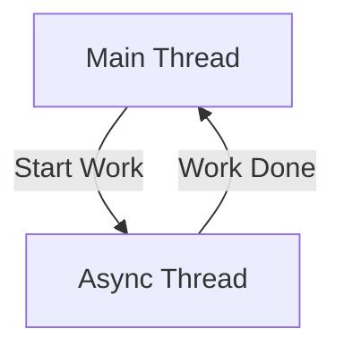

# Scheduling Tasks

Sometimes you don't want things to happen *right now*. Maybe you want a 3-second countdown, or you want to heal a player every 5 seconds.

That's what the **Scheduler** is for.

## Understanding "Ticks"

In Hytale (like Minecraft), time is measured in **ticks**. 
The server tries to run 20 ticks every second.

- **1 Second** = 20 ticks
- **0.5 Seconds** = 10 ticks
- **1 Minute** = 1200 ticks

::: tip Quick Math
`Seconds * 20 = Ticks`
:::


---

## 1. Running Tasks Later

Want to delay something? Use `runLater`.

```java
// Delay for 60 ticks (3 seconds)
context.getScheduler().runLater(() -> {
    player.sendMessage("3 seconds have passed!");
}, 60);
```

### Example: Teleport Warmup

```java
player.sendMessage("Teleporting in 5 seconds... don't move!");

context.getScheduler().runLater(() -> {
    player.teleport(spawnLocation);
    player.sendMessage("Whoosh!");
}, 100); // 5 * 20 = 100 ticks
```

---

## 2. Repeating Tasks

Want something to happen over and over? Use `runRepeating`.

```java
// Run every 20 ticks (1 second)
context.getScheduler().runRepeating(() -> {
    player.sendMessage("Spam!");
}, 20);
```

### Example: Countdown

This is a bit trickier because you need to stop it when it hits zero.

```java
public void startCountdown(Player player) {
    // We use an array so we can change the value inside the lambda
    final int[] seconds = {5};
    
    ScheduledTask task = context.getScheduler().runRepeating(() -> {
        if (seconds[0] > 0) {
            player.sendMessage("Starting in " + seconds[0] + "...");
            seconds[0]--;
        } else {
            player.sendMessage("GO!");
            // How do we stop this?!
        }
    }, 20);
}
```

Wait, how *do* we stop it?

---

## 3. Cancelling Tasks

When you start a repeating task, it gives you a `ScheduledTask` object. Keep this! It's your remote control to stop the task.

```java
ScheduledTask myTask = context.getScheduler().runRepeating(...);

// Later...
myTask.cancel();
```

### Properly Stopping the Countdown

```java
public void startCountdown(Player player) {
    AtomicInteger seconds = new AtomicInteger(5);
    
    // We need a reference to the task to cancel it inside itself
    // But we can't use 'task' before it's created! 
    // Trick: Create a container for the task
    AtomicReference<ScheduledTask> taskRef = new AtomicReference<>();
    
    ScheduledTask task = context.getScheduler().runRepeating(() -> {
        int left = seconds.getAndDecrement();
        
        if (left > 0) {
            player.sendMessage(left + "...");
        } else {
            player.sendMessage("GO!");
            // Cancel myself!
            if (taskRef.get() != null) {
                taskRef.get().cancel();
            }
        }
    }, 20);
    
    taskRef.set(task);
}
```

---

## 4. Async Tasks (Performance Limiters)

All the examples above run on the **Main Thread**. This is where the game lives. 
If you do something slow here (like talking to a database or downloading a file), the **whole server will freeze**!

To prevent lag, run slow things **Asynchronously** (Async).

```java
// Run on a separate thread (Async)
CompletableFuture.runAsync(() -> {
    // ⚠️ DANGER ZONE: Do NOT touch the world/players here!
    // Connect to database, calculate pi, download files...
    saveToDatabase(player);
    
    // Once done, go back to Main Thread to update the game
    context.getScheduler().runSync(() -> {
        player.sendMessage("Data saved!");
    });
});
```



::: danger The Golden Rule
**NEVER** access API objects (Player, World, Block) inside an Async task.
Only explicit thread-safe APIs (like strictly logging or immutable data) are safe.
Always switch back to `runSync` before touching the game world.
:::

---

## Best Practices

1. **Always Cancel:** If your plugin disables (`onDisable`), cancel all your tasks! Otherwise they keep running and cause errors.
   
   ```java
   private List<ScheduledTask> tasks = new ArrayList<>();
   
   @Override
   public void onDisable() {
       tasks.forEach(ScheduledTask::cancel);
   }
   ```

2. **Check Validity:** In a delayed task, check if the player is still online. They might have quit 2 seconds ago!

   ```java
   context.getScheduler().runLater(() -> {
       if (!player.isOnline()) return; // Safety check
       player.teleport(loc);
   }, 60);
   ```

---

## Next Steps

Now you've mastered time! You have explored the core of plugin development.

Check out the **Advanced Features** section for UI and Prefabs:

→ **Next: [Custom UIs](./custom-ui)**
