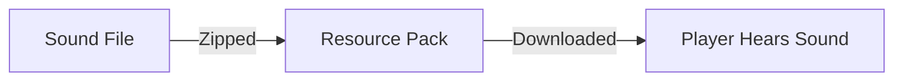

# Resource Packs

**Resource Packs** control the "feel" of the game. While Art Packs add 3D objects, Resource Packs handle the **sounds**, **music**, and **text**.

## What's Inside?

| Feature | Description |
|---------|-------------|
| **[Sounds](./sounds)** | Effect sounds, music discs, ambient tracks. |
| **[Localization](./localization)** | Translating your plugin into different languages. |
| **[Structure](./structure)** | How to organize these files. |

## How It Works

It's just like Art Packs: the server sends them to the player automatically.

## Difference vs Minecraft

In Minecraft, a "Resource Pack" does everything (Textures + Sounds).
In Hytale, we often separate **Art** (Visuals) from **Resources** (Audio/Text), though they technically go in the same `assets/` folder structure.

---

## Next Steps

Let's see how to organize your files:

→ **Next: [File Structure](./structure)**
