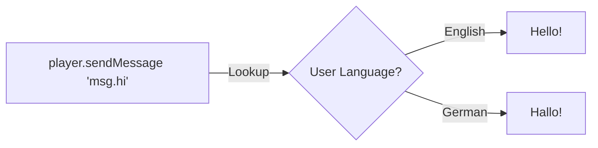

# Localization (Languages)

Not everyone speaks English. Localization (i18n) lets you support multiple languages easily.

## How it Works

Instead of hardcoding text like `"Hello!"`, you use a **Translation Key** like `"message.welcome"`. Hytale swaps it for the correct language at runtime.



---

## 1. Creating Language Files

Create JSON files in `assets/my_plugin/lang/`:

**en_us.json** (English):
```json
{
  "item.my_plugin.sword": "Super Sword",
  "message.my_plugin.welcome": "Welcome back, {0}!"
}
```

**de_de.json** (German):
```json
{
  "item.my_plugin.sword": "Superschwert",
  "message.my_plugin.welcome": "Willkommen zurück, {0}!"
}
```

---

## 2. Using Keys in Code

```java
// DON'T do this:
player.sendMessage("Welcome back, " + player.getName() + "!");

// DO this:
player.sendTranslatedMessage("message.my_plugin.welcome", player.getName());
```

Hytale automatically fills in `{0}` with the player's name.

---

## Standards

- **Items:** `item.my_plugin.item_name`
- **Blocks:** `tile.my_plugin.block_name`
- **Messages:** `message.my_plugin.description`

---

## Troubleshooting

| Problem | Solution |
|---------|----------|
| **Shows Raw Key** | If players see `message.welcome` instead of "Hello", the key is missing in the JSON file. |
| **Wrong Language** | Make sure your filename matches the language code (e.g. `es_es.json`). |

---

## Summary

You've reached the end of the Resource Pack guide!

You now know how to:
- [x] Organize your files
- [x] Add custom sounds
- [x] Translate your plugin

Time to build something amazing!
