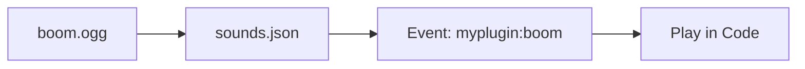

# Sounds & Music

Atmosphere is everything. Hytale allows you to add custom sound effects, ambient loops, and music discs.

## How it Works

1. **File:** You need an `.ogg` audio file.
2. **Definition:** You describe it in `sounds.json`.
3. **Trigger:** You play it using the API.



---

## 1. The Audio File

- **Format:** `.ogg` (Vorbis)
- **Channels:** Mono (for positional audio) or Stereo (for music/ambient).
- **Location:** `assets/my_plugin/sounds/`

::: tip Mono vs Stereo
- **Mono (1 channel):** Sound comes from a specific block/entity (3D). Use this for effects.
- **Stereo (2 channels):** Sound is played "in your head". Use this for music.
:::

---

## 2. definitions in sounds.json

Create `assets/my_plugin/sounds.json`. This tells Hytale how to play your files.

```json
{
  "my_magic_spell": {
    "category": "player",
    "sounds": [
      {
        "name": "my_plugin:sounds/magic_spell",
        "volume": 0.8,
        "pitch": 1.0
      }
    ]
  }
}
```

- **my_magic_spell**: The ID you use in code.
- **name**: The path to the file (without `.ogg`).

---

## 3. Playing the Sound

Now standard Hytale API can play it:

```java
player.playSound("my_plugin:my_magic_spell", location, 1.0f, 1.0f);
```

---

## Troubleshooting

| Problem | Cause | Solution |
|---------|-------|----------|
| **Silent** | Wrong path | Check `sounds.json` path. `my_plugin:sounds/file` means `assets/my_plugin/sounds/file.ogg`. |
| **Silent** | Wrong format | Must be `.ogg`. MP3/WAV won't work. |
| **Not 3D** | Stereo file | Convert the file to Mono in Audacity. |

---

## Next Steps

Make your plugin speak multiple languages:

→ **Next: [Localization](./localization)**
