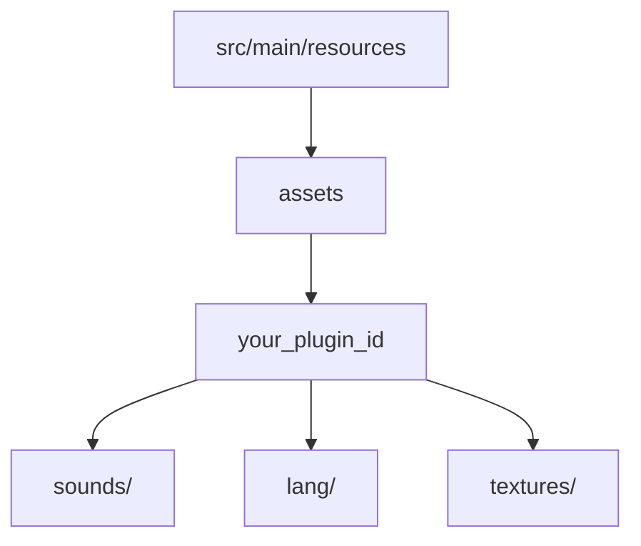

# File Structure

Keeping your project organized is key. Hytale expects files in very specific places.

## The Standard Layout

All resources go into `src/main/resources/assets/`.



---

## Folder Tree

Here is a complete example of a cleanly organized project:

```
src/main/resources/assets/my_plugin/
├── sounds.json          <-- Definitions of sound events
├── sounds/
│   ├── magic_spell.ogg
│   └── sword_hit.ogg
├── lang/
│   ├── en_us.json       <-- English text
│   └── de_de.json       <-- German text
├── textures/            <-- (See Art Packs)
│   └── icon.png
└── models/              <-- (See Art Packs)
    └── staff.json
```

---

## Namespaces

Notice the folder `my_plugin`? That's your **Namespace**.
It prevents your "sword.png" from overwriting someone else's "sword.png".

::: tip Convention
Always use your **plugin ID** (snake_case) as your namespace folder.
:::

---

## Troubleshooting

| Problem | Cause | Solution |
|---------|-------|----------|
| **"File Not Found"** | Wrong folder | Check if you put it in `assets/your_id/` and not just `assets/`. |
| **Assets don't update** | Cache | Sometimes you need to fully clean the build or restart the client. |

---

## Next Steps

Let's add some noise:

→ **Next: [Sounds & Music](./sounds)**
